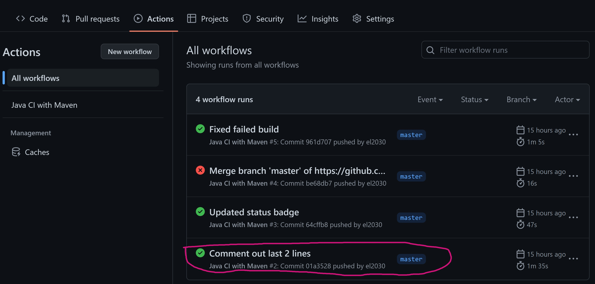

I forgot to take screenshots during the process so I had to recreate some of the steps, which may reflect in the history section of action tab.
1. Your GitHub account showing that is has been forked from the depaulcdm/springpetclinic repository. This doesn’t actually need an image – I can see it
from your repository.

2. Your GitHub Actions dashboard showing a successful first build.

3. Your GitHub repository with the readme.md file selected showing the code that you
changed to update the badge.

4. Your GitHub repository with the readme.md file selected showing the build success
status after you’ve updated the badge markdown.

5. The section of the POM file showing the coordinates after you’ve commented them
out.

6. Your GitHub Actions dashboard showing the unsuccessful build after the breaking
change.

7. Your GitHub repository with the readme.md file selected showing the build failed
status after the GitHub workflow fails.

8. The section of the POM file showing the coordinates after you’ve fixed them.

9. Your GitHub Actions dashboard showing the successful build after the breaking
change has been fixed.

10. Your GitHub repository with the readme.md file selected showing the build success
status after the GitHub workflow has recovered.
